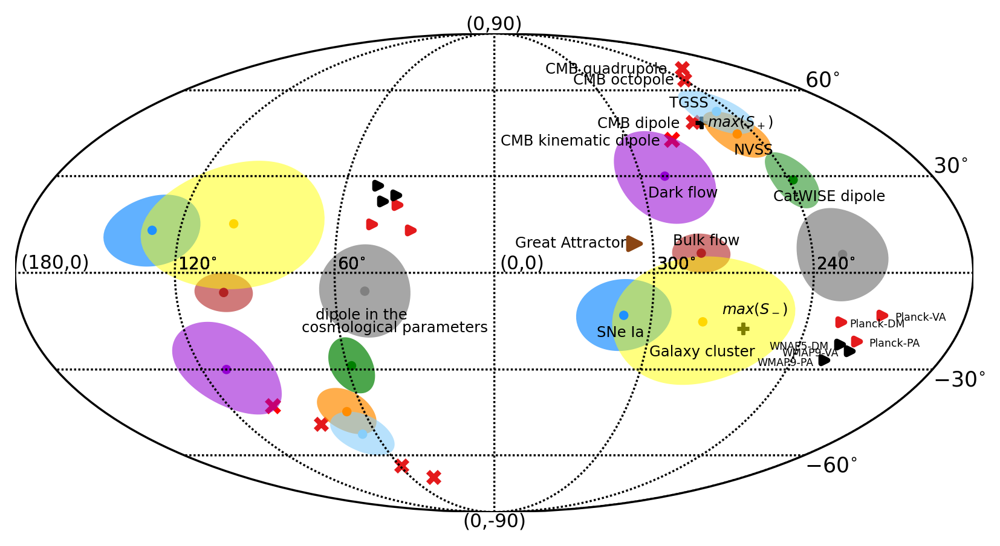

# dipole-sky
The Fig.1 at  *Is the Observable Universe Consistent with the Cosmological Principle?*

https://arxiv.org/abs/2207.05765

To use this code please cite the paper.

----

The old dipole plot in Fig. 25 at https://arxiv.org/abs/2203.06142

The data point from the Dr. **Evgeny Zavarygin's** PhD thesis.  We thanks the suggestion and discussion with him about the code. An download the thesis using the following link: https://doi.org/10.26190/unsworks/21719  .All the coordinates are given in Chapter 4.

Speaking of the script to make that figure, can use this python library:

https://matplotlib.org/basemap/

